```{r initialise, echo=FALSE, include=FALSE}

# --- 1. OPTIONS KNITR ---
knitr::opts_chunk$set(
  echo = FALSE,        # Ne pas afficher le code dans le PDF
  warning = FALSE, 
  message = FALSE,
  fig.width = 8,
  fig.height = 5,
  fig.align = 'center',
  dpi = 300,
  out.width = "90%"
)

# Configuration spécifique pour PDF/HTML
if (knitr::is_latex_output()) {
  options(knitr.table.format = "latex")
} else {
  options(knitr.table.format = "html")
}

source("main.R")

```


\includepdf{medias/page_de_garde.pdf}
\newpage

\pagenumbering{gobble}
\thispagestyle{empty}
\vspace*{\fill}
\begin{flushleft}
\fontsize{11}{13}\selectfont
\textit{Le Sèmè City Open Park est un lieu de libération. Un espace où l'on désapprend la peur de créer, où l'éducation devient action, et où chaque idée, même fragile, a le droit d'exister. C'est un terrain d'expérimentation, de résilience et de partage, où l'on fait plus avec moins, ensemble. Un endroit où l'Afrique ne se rêve pas en retard, mais se construit, ici et maintenant, par celles et ceux qui osent essayer.}
\end{flushleft}
\newpage

\pagenumbering{arabic}
\setcounter{page}{1}

\newpage
\pagenumbering{roman}
\setcounter{page}{1}

\tableofcontents
\newpage

\pagenumbering{arabic}
\setcounter{page}{1}


# Résumé de l'étude

<!-- Donner la vision d’ensemble, lisible sans lire le reste -->

Cette étude vise à comprendre et à améliorer la fréquentation du Sèmè City Open Park à partir de l’analyse des données d’usage disponibles. Elle repose sur l’exploitation des données issues de Smart SCOP, couvrant 14 809 visites réalisées par 3 540 usagers uniques sur 209 jours d’ouverture.

L’analyse montre que la fréquentation du SCOP n’est ni aléatoire ni uniquement conditionnée par les infrastructures ou la programmation. Elle est structurée par des dynamiques internes fortes : un noyau réduit d’usagers très engagés, des rythmes temporels marqués, une attractivité spatiale inégale et un point de bascule décisif situé dès la première visite.

En mobilisant des analyses descriptives, comportementales et une modélisation multivariée (Random Forest expliquant près de 70 % de la variance observée), l’étude identifie des facteurs d’influence hiérarchisés, majoritairement maîtrisables par le parc. Ces résultats permettent de formuler des préconisations stratégiques concrètes, orientées vers l’activation de l’existant plutôt que la croissance externe.

L’enjeu principal n’est pas d’attirer toujours plus d’usagers, mais de mieux accueillir, mieux orienter et mieux fidéliser ceux qui franchissent déjà les portes du Sèmè City Open Park.


## Vers une qualification des usagers du Sèmè City Open Park

<!-- Comprendre qui fréquente le lieu, comment et à quel rythme -->

L’analyse met en évidence une fréquentation très hétérogène, tant dans son intensité que dans ses formes.

La majorité des usagers (55,9 %) ne visitent le parc qu’une seule fois, tandis qu’une minorité restreinte (7,9 %) génère à elle seule plus de la moitié des visites totales. Cette structure en longue traîne révèle une dépendance forte à un noyau d’usagers engagés, autour duquel gravite une population majoritairement occasionnelle.

Les usages observés montrent également que le SCOP est avant tout un lieu d’ancrage : la durée moyenne d’une visite dépasse 4 h 30, et près d’un tiers des visites excèdent 6 heures. La fréquentation est principalement concentrée en semaine et sur quelques espaces clés, tandis que de nombreux espaces et créneaux horaires restent sous-utilisés.

Sur le plan des profils, l’usager moyen est jeune (environ 25 ans), majoritairement masculin, étudiant dans les domaines du numérique et résidant à Cotonou ou dans ses environs. Toutefois, les caractéristiques sociodémographiques expliquent peu la fréquentation une fois les dynamiques internes prises en compte.

Enfin, la première visite apparaît comme un moment critique : plus d’un usager sur deux ne revient jamais, et près d’un quart des visites ont lieu le jour même de l’inscription. La trajectoire d’engagement se joue donc très tôt, souvent dès les premiers contacts avec le lieu.


## Que faire dès aujourd'hui ?
<!-- Traduire immédiatement les constats en pistes d’action -->

Les enseignements issus de l’analyse convergent vers un constat clair :
les leviers d’amélioration de la fréquentation sont internes, actionnables et peu coûteux.

Trois axes prioritaires peuvent être activés immédiatement :

- 1. Sécuriser la première visite
La rétention initiale constitue le levier le plus critique. Structurer l’onboarding, clarifier le parcours d’accueil et instaurer un suivi systématique après la première visite permettrait de transformer une part significative des visiteurs occasionnels en usagers récurrents.

- 2. Rééquilibrer l’usage des espaces
La fréquentation actuelle repose sur un nombre limité d’espaces. Encourager la découverte et la circulation entre espaces existants permettrait d’augmenter la fréquentation globale sans accroître la pression sur les zones déjà saturées.

- 3. Exploiter les temps faibles sans dégrader l’expérience
Certains jours et créneaux horaires présentent un fort potentiel latent. Des activations légères et ciblées permettraient de lisser la fréquentation dans le temps, en optimisant l’usage de la capacité existante.

Les simulations montrent qu’en combinant ces actions, le parc pourrait théoriquement générer un volume de fréquentation nettement supérieur à l’existant. Ces résultats doivent être compris non comme des prévisions mécaniques, mais comme l’expression d’un potentiel latent aujourd’hui sous-exploité.


\newpage

# Introduction

Un tiers lieu comme le Sèmè City Open Park ne vit pas uniquement de ses infrastructures, de ses machines ou de ses programmes. Il vit avant tout de celles et ceux qui le traversent, qui s’y arrêtent, qui partent et qui y reviennent… Depuis son ouverture au public en avril 2022, le Sèmè City Open Park a vu défiler une grande diversité de profils. Certains viennent d'abord par curiosité, d’autres par nécessité. Mais après quelques jours à vivre cette expérience qui n'existe nulle part ailleurs en ce monde, quelques-uns finissent par rester. Cette pluralité est une force, mais elle rend difficile toute lecture intuitive des dynamiques de fréquentation. En effet, ce que l’on croit percevoir à l’œil nu ne reflète pas toujours la réalité des usages.

Améliorer la fréquentation d’un tel espace ne consiste donc pas simplement à augmenter des chiffres. C’est une démarche plus profonde, qui interroge le rapport entre un lieu et ses usagers, entre une promesse et son appropriation réelle. Dans ce contexte, la donnée devient une mémoire silencieuse. Elle conserve les traces des passages, des habitudes, des absences. Encore faut-il savoir l’écouter, la nettoyer, la structurer et l’interpréter. C’est précisément l’ambition de ce travail, articulé autour de la question suivante : comment améliorer la fréquentation du Sèmè City Open Park à partir de l’analyse des données d’usage disponibles ?

Pour y répondre, cette étude mobilise une démarche rigoureuse d’analyse de données, allant du nettoyage avancé des bases existantes à leur enrichissement par des variables temporelles et comportementales. L’objectif n’est pas uniquement de regarder en arrière, mais de faire émerger des signaux utiles pour l’action, capables d’éclairer les décisions stratégiques à venir.


# Méthodologie de l'étude
<!-- Expliquer comment la donnée a été transformée en connaissance -->

Comprendre la fréquentation du Sèmè City Open Park ne peut heuresement se faire à partir d’une seule photographie figée. Il a fallu retrousser ses manches, collecter de la matière brute, très imparfaite et fragmentée, que constituent les données. Nos choix méthodologiques ont été fait pour respecter la réalité du lieu telle qu’elle est vécue, tout en lui donnant une forme analytique exploitable.


## Sources de données utilisées
<!-- Origine, volume et nature des données -->

```{r}

n_obs_data_presence_raw <- nrow(data_presences_raw)
n_vars_data_presence_raw <- ncol(data_presences_raw)

n_obs_data_usagers_raw <- nrow(data_usagers_raw)
n_vars_data_usagers_raw <- ncol(data_usagers_raw)

```

Cette étude repose sur 03 sources de données principales. La première, SmartSCOP, un logiciel interne au SCOP qui nous aide à retracer les flux d'entrée sortie du SCOP. C'est le régistre numérique qu'utilisent les usagers lorsqu'ils visitent le Sèmè City Open Park. De cet outil, nous avons extrait au format excel, deux bases essentielles : 

- data_presences_raw, qui contient contient `r n_obs_data_presence_raw` observations et 
`r n_vars_data_presence_raw` variables. Ces données renseignent sur les passages mesurés au sein du parc ;

- data_usagers_raw, qui contient contient `r n_obs_data_usagers_raw` observations et 
`r n_vars_data_usagers_raw` variables. Elle renseigne sur les usagers qui fréquentent le SCOP ;

Prises isolément, ces sources offrent une vision partielle. Croisées et harmonisées, elles deviennent une mémoire collective du lieu.


## Nettoyage et transformation des données
<!-- 
Nettoyage des entités HTML, Harmonisation des variables qualitatives, Panelisation (jour / usagers), Feature engineering (variables temporelles, récurrence)
-->

### Nettoyage des entités HTML

Les enrégistrement sur les espaces visités par les usagers dans la base de données de présence, de même que les motifs de visite présentaient des traces techniques, notamment des entités HTML parasites (comme `&amp;` pour -) issues des outils de saisie. Certains caractères spéciaux comme les accents, les tierts, apostrophes, étaient donc camouflés derrière ces entités parasites. Nous avons donc créé une fonction qui détectait différents types d'entités et les remplaçaient par le caractère correspondant en encodage UTF-8.

Leur suppression a constitué une étape essentielle pour restaurer la lisibilité des informations et éviter toute distorsion dans les analyses ultérieures. Ce travail minutieux a permis de fiabiliser plusieurs milliers d’enregistrements et de réduire significativement le bruit dans les variables textuelles dans les bases de données brutes.

### Harmonisation des variables qualitatives
<!-- Distance de chaines (méthode ) -->

Sur des variables comme l'université d'appartenance, le profil ou même la ville de résidence dans la base de données des usagers, une même information pouvait être orthographiée différemment, abrégée ou saisie de manière approximative. Pour répondre à cette hétérogénéité des données, des techniques de distance de chaînes de Jaro-Winkler et de vérification d’acronymes ont été mobilisées.

Pour rappel, la distance de chaîne (ou distance d'édition) mesure la similarité entre deux chaînes de caractères en comptant le nombre minimal d'opérations nécessaires pour transformer l'une en l'autre. La méthode de Jaro-Winkler employée ici donne plus de poids aux correspondances au début de la chaîne (utile pour les noms), qui était l'idéale pour les données en présence (nom d'universités, de compétences, de profils). C'est un outil puissant pour gérer les erreurs de saisie, les variations d'orthographe ou les approximations dans les données textuelles.

Le tableau ci-dessous présente les résultats de l'harmonisation des variables textuelles de la base `data_usagers`. Valeurs indiquent le nombre de valeurs uniques détectées avant et après harmonisation.

```{r, echo=FALSE}
# Créer le tableau récapitulatif
harmonization_summary <- tibble(
  Variable = c("Université", "Ville", "Profil", "Filière d'étude"),
  `Valeurs avant` = c(287, 141, 515, 391),
  `Valeurs après` = c(181, 108, 342, 252),
  `Réduction` = c(106, 33, 173, 139),
  `Equivalence (%)` = c(36.9, 23.4, 33.6, 35.5)
)

# Afficher le tableau avec kable
library(kableExtra)

kable(harmonization_summary, format = "pipe", caption = "Résultats de l'harmonisation des variables textuelles")
```

L'harmonisation a donc permis de réduire significativement le nombre de variations pour chaque variable, avec une réduction moyenne de `r round(mean(harmonization_summary$'Equivalence (%)'), 1)`% des valeurs uniques. La variable la plus impactée est l'université avec une réduction de `r harmonization_summary$'Equivalence (%)'[1]`%, tandis que la ville présente le taux le plus faible à `r harmonization_summary$'Equivalence (%)'[2]`%.

### Clé d'identification des usagers

Après observations de la base de donnée des présences, le numéro de téléphone a été retenu comme clé principale d’identification des usagers, car il constitue l’information la plus stable et la plus fréquemment renseignée. Ce choix, ancré dans la réalité opérationnelle du terrain, a permis de relier efficacement les informations de présences aux usagers uniques qui les génèrent.

### Panelisation des tables

Afin de capter la dynamique temporelle de la fréquentation, les données ont été panelisées selon deux axes complémentaires :

- un panel journalier, permettant d’observer l’évolution de la fréquentation dans le temps ;

- un panel par usager, permettant de reconstituer des comportements individuels propres à chacun.

Cette double lecture a révélé que la fréquentation est loin d’être linéaire. Certains jours concentrent une activité très élevée, tandis que d’autres restent en retrait. De la même manière, quelques usagers concentrent une part importante des passages, illustrant un phénomène classique de type longue traîne que nous détaillerons dans la cartographie de la fréquentation du SCOP.

### Feature engineering

Pour dépasser une lecture brute des présences, un travail d’enrichissement a été mené à travers la création de nouvelles variables :

- des variables temporelles (jour de la semaine, effets calendaires) ;
- des indicateurs de récurrence ;
- des moyennes flottantes permettant de lisser les variations quotidiennes.

Ces features ont joué un rôle clé dans l’analyse. Par exemple, certaines variables temporelles expliquent à elles seules plus d’un tiers de la variabilité observée dans la fréquentation, confirmant le rôle central des rythmes hebdomadaires et organisationnels.


## Construction de la base de données d'analyse
<!-- Choix des variables, identifiants, consolidation -->

Après un nettoyage approfondi et une harmonisation des variables textuelles par détection d'acronymes et calcul de distance de chaînes, ces deux bases ont été fusionnées par numéro de téléphone avec un taux de correspondance de 100% (`r nrow(data_usagers_comportement)` téléphones correspondants). Cette jointure a permis de créer deux bases de travail complémentaires. 

La première, `data_frequentation`, contient `r nrow(data_frequentation)` observations correspondant aux visites individuelles enrichies des informations de profil (âge, université, filière, etc.) et des variables calculées (durée de visite, ancienneté journalière). Cette base présente un taux de complétude élevé, avec seulement 0,3% de valeurs manquantes pour les variables de flux et entre 22,6% et 57,6% pour les variables de profil optionnelles pour les usagers.

La seconde base, `data_usagers_comportement`, agrège ces visites au niveau usager et contient `r nrow(data_usagers_comportement)` individus uniques caractérisés par 30 variables comportementales (nombre de visites, durées moyennes, espaces fréquentés, régularité).

Ces deux bases complémentaires permettent respectivement des analyses au niveau des flux de fréquentation et au niveau des comportements individuels des usagers.


## Traitement des valeurs manquantes (NA)

Les valeurs manquantes dans les deux bases de données créées présentent des profils distincts liés à leur nature respective. Dans `data_frequentation`, les données manquantes sont principalement concentrées sur les variables de profil optionnelles : `r round(sum(is.na(data_frequentation$field_of_study)) / nrow(data_frequentation) * 100, 1)`% pour la filière d'étude, `r round(sum(is.na(data_frequentation$university)) / nrow(data_frequentation) * 100, 1)`% pour l'université et `r round(sum(is.na(data_frequentation$profile)) / nrow(data_frequentation) * 100, 1)`% pour le profil. Ces valeurs manquantes reflètent le caractère facultatif de ces informations lors de l'inscription des usagers et ne compromettent pas les analyses de flux temporel ou spatial. En revanche, les variables critiques de fréquentation (dates d'arrivée, espaces visités) ne présentent aucune valeur manquante, garantissant l'intégrité des analyses comportementales. Seule la variable `departure_time` affiche un taux de 0,3% de valeurs manquantes, correspondant à des sessions où l'heure de départ n'a pas été enregistrée.

Dans `data_usagers_comportement`, les valeurs manquantes suivent la même logique puisque cette base agrège les informations au niveau usager. Les variables comportementales calculées (nombre de visites, durées moyennes, régularité) ne contiennent aucune valeur manquante car elles sont dérivées directement des enregistrements de présence. Les variables sociodémographiques (âge, sexe, handicap) présentent également un taux de complétude élevé, car elles constituent des informations de base collectées systématiquement.

Le choix a été fait de **conserver toutes les observations** avec leurs valeurs manquantes plutôt que de supprimer des lignes, afin de maximiser la taille de l'échantillon pour les analyses. Les valeurs manquantes seront traitées de manière spécifique selon le type d'analyse : exclusion ponctuelle pour les analyses nécessitant la variable concernée, imputation par la modalité la plus fréquente pour certaines modélisations, ou création d'une catégorie "Non renseigné" pour les analyses descriptives conservant l'information sur le non-renseignement lui-même.


## Packages et librairies utilisées

L'analyse de la fréquentation du Sèmè City Open Park s'appuie sur un écosystème de `r length(packages)` packages R spécialisés, couvrant l'ensemble de la chaîne analytique. La manipulation des données repose principalement sur le **tidyverse** (dplyr, tidyr, stringr) complété par **data.table** pour les opérations volumineuses, et **janitor** pour le nettoyage initial. Le traitement des dates et heures utilise **lubridate** et **hms**, essentiels pour l'analyse temporelle de la fréquentation. L'harmonisation des variables textuelles mobilise **stringdist** pour le calcul des distances de chaînes et **fuzzyjoin** pour les jointures approximatives, permettant de réduire les variations orthographiques de 23% à 37% selon les variables.

La phase exploratoire combine **summarytools** pour les statistiques descriptives, **naniar** et **VIM** pour l'analyse des valeurs manquantes, ainsi que **psych** pour les corrélations et les statistiques multivariées. La visualisation s'articule autour de **ggplot2** enrichi de plusieurs extensions : **patchwork** pour l'assemblage de graphiques, **ggridges** pour les distributions temporelles, **viridis** pour les palettes de couleurs accessibles, et **plotly** pour l'interactivité. Les analyses spatiales utilisent **leaflet** pour la cartographie interactive et **rnaturalearth** pour les fonds de carte.

Pour la modélisation prédictive et le machine learning, l'environnement intègre **caret** comme framework unifié, **randomForest** et **xgboost** pour les méthodes ensemblistes, **glmnet** pour la régularisation, et **pROC** pour l'évaluation des performances. L'analyse multivariée repose sur **FactoMineR** et **factoextra** pour les ACP et classifications, tandis que les prévisions temporelles mobilisent **forecast** et **prophet**. L'interprétabilité des modèles est assurée par **pdp** (Partial Dependence Plots), **iml** et **DALEX** pour comprendre les contributions des variables. Enfin, la gestion rigoureuse des conflits de namespace entre packages (notamment entre plyr/dplyr et base/lubridate) est orchestrée par **conflicted**, garantissant la reproductibilité des analyses et évitant les comportements inattendus dans le pipeline de traitement.


# Présentation du Sèmè City Open Park

(Commencer un premier paragraphe)


La fréquentation du Sèmè City Open Park n’est pas un problème à résoudre, mais une dynamique à lire, à accompagner et à amplifier.


# Orientation stratégique de l'analyse

Toute analyse de données implique des choix. Choisir, c’est renoncer.
Dans le cadre de cette étude, ces choix n’ont pas été dictés par la facilité, mais par une volonté claire : produire une analyse utile, actionnable et alignée avec les enjeux réels du Sèmè City Open Park.

## Durée considérée pour l’analyse

Bien que le SCOP opère des activités depuis avril 2022, l’analyse s’est concentrée sur une période de `r periode$nb_jours_total`, du `r periode$date_debut` au `r periode$date_fin`. Cela correspond à la période d'exploitation de l'outil smartscop, déployé plus tôt cette année.

Ce n'est qu'une goute d'eau dans l'histoire du SCOP, et pas de la meilleure période, je peux vous l'affirmer. Cependant, cette durée permet quand même d’observer :

- des cycles hebdomadaires nets ;
- des variations saisonnières ;
- et des phénomènes de récurrence chez certains usagers.

Pourquoi ne pas êtr remonté plus loin ? En réalité, nous dispositions en version papier de plusieurs régistres qui renseignent les flux d'usagers depuis l'ouverture, et d'archives de listes de présence aux activités clés menées sur le site depuis 2022.

Une démarche d'extraction des données a été initiée au moment de mon stage, donnant naissance à une base de données d'activité, que nous avons finalement dû écarter de cette étude.


## Suppression de la base de données d’activité

Ce choix peut sembler contre-intuitif. Pourtant, il répond à une logique claire. Premièrement, à peine 38 % des usagers enrégistrés auraient réellement participé aux activités sur cette période. Cela réflète une sous-utilisation de l'outil smartscop, pourtant dédié à la gestion du flux d'usagers. Ce qui aurait généré une perte énorme d'informations en cas de jointures.

De plus, l’objectif de l’étude n'était pas d’évaluer la performance intrinsèque des activités proposées, mais de comprendre les dynamiques globales de fréquentation indépendamment des formats spécifiques.

Intégrer trop tôt la dimension “activité” aurait risqué de brouiller la lecture, en confondant :

- l’effet du lieu,
- l’effet de la programmation,
- et l’effet des comportements individuels.

En se concentrant d’abord sur les présences et les comportements d’usagers, l’analyse a pu mettre en évidence des régularités robustes. Ces résultats constituent une base saine sur laquelle des analyses futures, plus ciblées sur les activités, pourront s’appuyer une fois la reconstitution des données complétées.


\newpage

# Cartographie de la fréquentation du Sèmè City Open Park

Le Sèmè City Open Park est ouvert au public, du lundi au Samedi, de 09 h à 22 h inclus. Cette année, nous avons enrégistré 14 809 visites, réalisées par 3 540 usagers uniques, sur 245 jours d’observation, dont 209 jours effectivement ouverts, soit un taux d’ouverture de 85 %.

Les observations effectuées révèlera que l’enjeu principal n’est pas tant l’attraction ponctuelle que la transformation des primo-visiteurs en usagers récurrents.


## Ampleur et structure de la fréquentation

```{r}
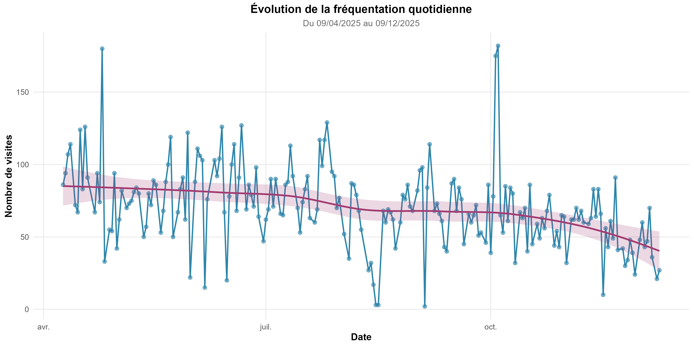

```


Le moins que l'on puisse dire, c'est que le rythme de fréquentation au Sèmè City Open Park est très dynamique. Les visites quotidiennes oscillent entre `{r min(data_daily$nb_visites) }` (les jours de fermetture comme le dimanche) et `{r max(data_daily$nb_visites) }` visites par jour, avec une moyenne générale à environ `{r round(mean(data_daily$nb_visites), 0) }` visites par jour.

En prenant un peu de recul, on remarque très vite que, mis bout à bout, ces flux quotidiens génèrent quand même un traffic mensuel assez important, entre 1352 en Aôut contre 2252 le mois précédent.


```{r}
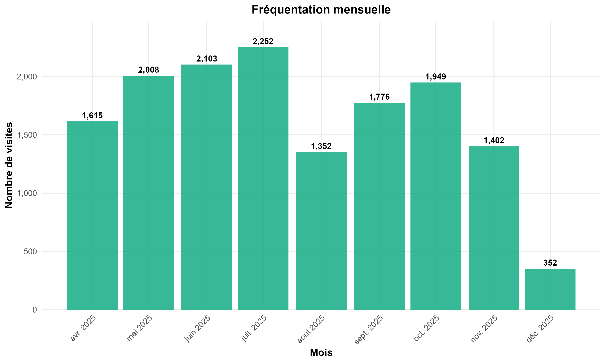
```
Ces chiffres traduisent une activité soutenue, mais surtout une fréquentation très inégalement répartie entre les différents individus.

```{r}
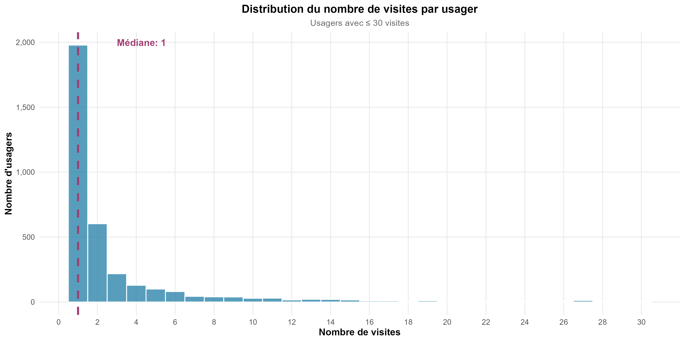

```

En effet, l’analyse révèle une structure fortement concentrée :

- 55,9 % des usagers enrégistrés ne sont venus qu’une seule fois ;
- 7,9 % des usagers génèrent à eux seuls 55,4 % de l’ensemble des visites.

Cette dissymétrie indique que la fréquentation du lieu repose largement sur un noyau réduit d’usagers très engagés, autour duquel gravite une majorité de visiteurs occasionnels.


## Rythmes, cycles et contrastes

### Journées les plus fréquentées

La fréquentation du Sèmè City Open Park n’est pas constante. Elle suit des cycles nets, observables à l’échelle mensuelle, hebdomadaire et journalière. Les analyses temporelles montrent que la fréquentation est majoritairement concentrée en semaine, avec 83,6 % des visites, contre 16,4 % le week-end.

```{r}
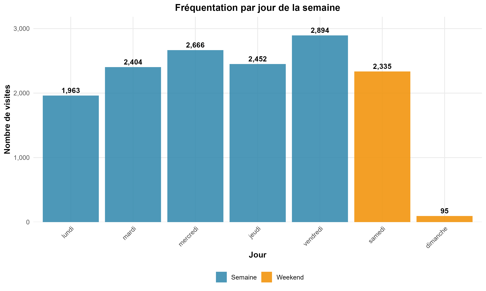
```

Le vendredi apparaît comme le jour le plus actif, avec 2894 visites cumulées, tandis que le dimanche est de loin le jour le moins fréquenté, avec seulement 95 visites sur l’ensemble de la période. L’écart entre ces deux journées atteint 132 %, illustrant un potentiel d’optimisation considérable.


### Horaires et durées des visites

L’analyse des heures d’arrivée montre une fréquentation principalement concentrée entre 9h et 18h, avec un pic des arrivées marqué autour de 10h et une heure moyenne d’arrivée située à 14h.

```{r}
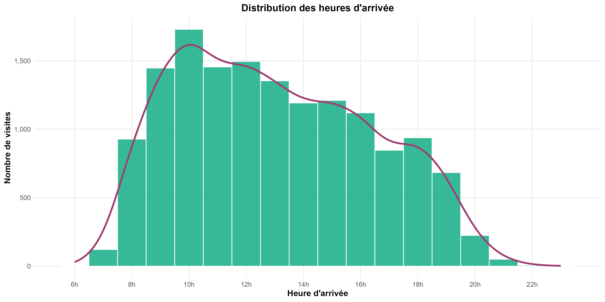
```

Les durées de visite sont particulièrement révélatrices du type d’usage du lieu :

- la durée médiane est de 218 minutes (environ 3h40) ;
- la durée moyenne atteint 282 minutes (4h42) ;
- 31,7 % des visites dépassent 6 heures de temps ;
- seulement 18,1 % des visites durent moins de 60 minutes.

```{r}
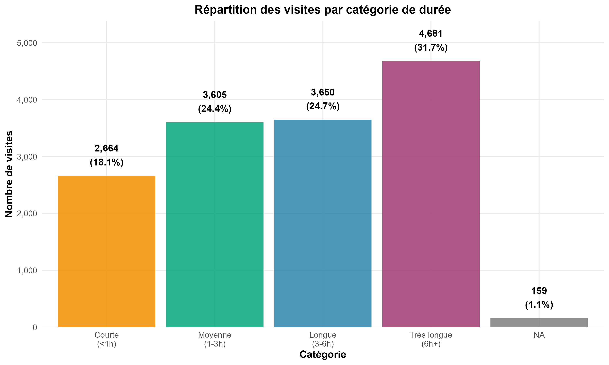
```

Ces chiffres montrent que le Sèmè City Open Park n’est pas un lieu de passage rapide, mais un lieu d’ancrage, où les usagers s’installent dans le temps.

## Utilisation de l'espace : concentrations et déséquilibres

Le Sèmè City Open Park compte 29 espaces actifs, mais leur fréquentation est loin d’être homogène. Les résultats montrent une forte concentration sur très peu d'espaces :

- les 3 espaces les plus fréquentés concentrent 51,8 % des visites ;
- le Rooftop, à lui seul, totalise 3622 visites, ce qui en fait l’espace le plus attractif du site.

```{r}
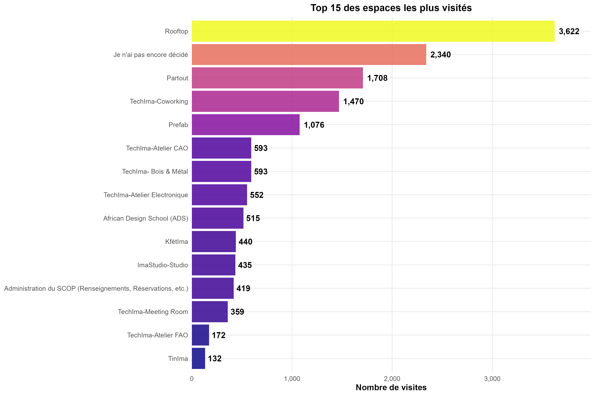
```

L’analyse des patterns hebdomadaires des cinq espaces les plus fréquentés met aussi en évidence des comportements différenciés selon les jours de la semaine. Cette interaction confirme que le jour de la semaine agit comme un amplificateur ou un frein, mais que la hiérarchie des espaces reste stable.

```{r}
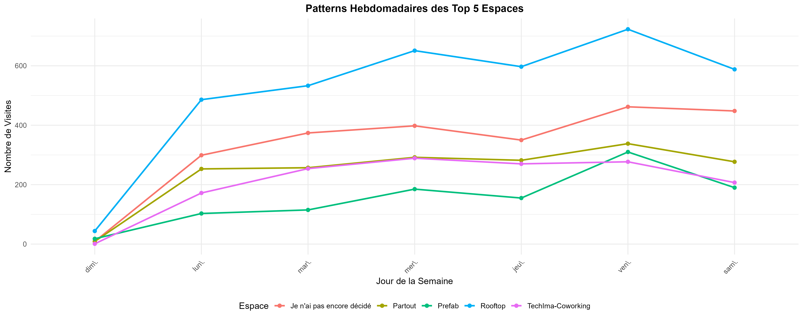
```

À l’inverse, 11 espaces sont identifiés comme sous-utilisés, avec moins de 50 visites chacun, représentant au total seulement 0,6 % de la fréquentation globale.

Cette répartition suggère que l’amélioration de la fréquentation ne passe pas uniquement par l’acquisition de nouveaux usagers, mais aussi par une meilleure répartition des flux internes.

## Profil démographique des usagers

### Le sexe masculin domine sur le parc

Le parc présente une forte disparité de genre avec une prédominance masculine marquée. Les hommes représentent 75,1% des usagers contre 24,9% pour les femmes, soit un ratio de 3:1. Cette asymétrie pose la question de l'attractivité différenciée du parc selon le genre et suggère des axes d'amélioration pour diversifier le public.


### L'utilisateur moyen a 25 ans

La population du parc est majoritairement jeune avec un âge médian de 23 ans et une moyenne de 24 ans. La distribution révèle une forte concentration dans la tranche 20-24 ans qui représente à elle seule 50,2% des usagers.

```{r}
knitr::include_graphics("outputs/figures/09_pyramide_ages.png")
```

Cette caractéristique s'explique par la proximité d'établissements universitaires, notamment Epitech, Africa DEsign School et l'Université d'Abomey-Calavi (UAC), qui constituent le principal réservoir d'usagers.


### Il réside à Cotonou et ses environs

Les usagers du Sèmè City Open Park proviennent de 108 villes différentes, mais cette diversité est très concentrée :

- les 5 premières villes représentent 93,6 % des visites,
- la ville de Cotonou concentre à elle seule 55,7 % des visites.

```{r}
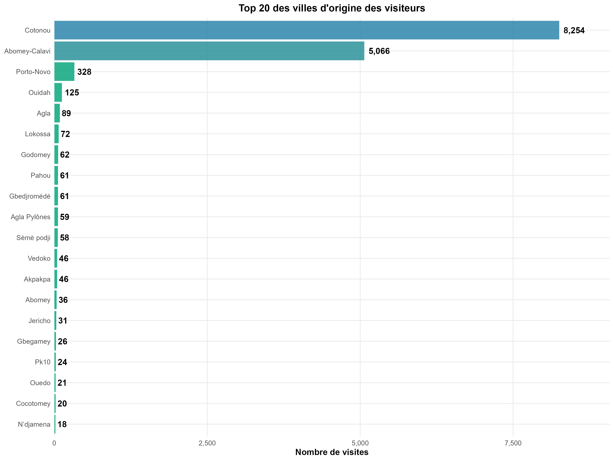
```

L’indice de concentration géographique (HHI = 0,4284) confirme un ancrage territorial très marqué, avec une faible diffusion géographique actuelle.

### Il est étudiant en informatique et technologies numériques

287 établissements différents sont recensés, témoignant d'une diversité remarquable. Cependant, le taux de renseignement de 44,2% indique qu'une part importante des usagers ne déclare pas leur affiliation, ce qui peut biaiser l'analyse.

La distribution des domaines d'étude reflète la vocation technologique et innovante du parc. Avec 391 domaines différents recensés (réduits à 252 après harmonisation), la diversité disciplinaire est remarquable, bien que le taux de renseignement de 42,4% limite la portée de cette analyse.

### Ses motivations sont très personnelles


```{r}
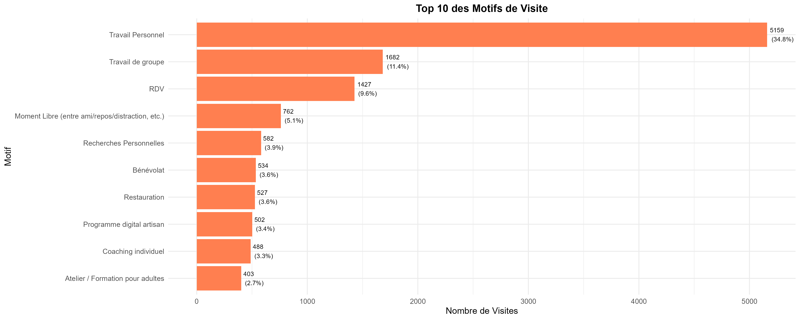
```

Le travail personnel est le motif le plus utilisé par les usagers du Sèmè City Open Park, qui bénéficient sans doute de l'expérience SCOP : un kit de démarrage dans le parc, où ils peuvent accéder à un espace de travail libre et confortable, de l'électricité et une connexion internet.


## Un comportement hétérogène

### Segmentation par fréquence de visite

La segmentation comportementale des usagers permet d’identifier quatre profils principaux de visiteurs :

- Les Occasionnels (1 visite) : 1978 usagers (55,9 %)
- Les Explorateurs (2–5 visites) : 1050 usagers (29,7 %)
- Les Réguliers (6–10 visites) : 233 usagers (6,6 %)
- Les Fidèles (11+ visites) : 279 usagers (7,9 %)

Malgré leur faible proportion, les usagers fidèles génèrent plus de la moitié des visites totales, avec une durée moyenne par visite de 290 minutes et un score d’engagement maximal.

### Ancienneté et fidélisation

L’analyse de l’ancienneté montre une fragilité importante de la rétention :

- 56,7 % des usagers n’ont qu’un jour d’ancienneté (une seule visite) ;
- 73,4 % des usagers ont une ancienneté inférieure à 30 jours ;
- seuls 16,3 % dépassent 90 jours d’ancienneté.

Par ailleurs, 24,5 % des visites sont effectuées le jour même de l’inscription, confirmant le caractère critique et déterminant de la première expérience pour la suite.

### Préférences au niveau des espaces

L'analyse des comportements individuels révèle une faible mobilité inter-espaces :

- 70,3% des usagers fréquentent un seul espace (mono-espace) ;
- 25,4% utilisent 2 à 3 espaces ;
- 4,3% diversifient leur usage sur 4 espaces ou plus.

Cette concentration pose question sur la découvrabilité et la polyvalence de l'offre. Les usagers mono-espace représentent un potentiel de diversification considérable : 2 489 usagers pourraient être incités à explorer d'autres espaces.


## Formulation des hypothèses de recherche

La cartographie de la fréquentation du Sèmè City Open Park, plusieurs régularités fortes émergent. Ces constats empiriques permettent de formuler trois hypothèses de recherche structurantes, qui guideront l’analyse des facteurs d’influence et la discussion des résultats.

### La fréquentation du parc est principalement déterminée par des dynamiques internes au lieu

La cartographie met en évidence une forte concentration de la fréquentation dans le temps, dans l’espace et autour d’un noyau réduit d’usagers. Les écarts observés entre jours, espaces et profils suggèrent que la fréquentation dépend moins de facteurs exogènes (profil sociodémographique, contexte externe) que de mécanismes internes propres au fonctionnement du parc.

Hypothèse H1 :

> La fréquentation du Sèmè City Open Park est majoritairement expliquée par des dynamiques internes, liées à l’organisation du lieu, à l’activation des espaces et aux comportements cumulés des usagers.

### La première visite constitue un point de bascule décisif dans la trajectoire d’engagement

La cartographie révèle une proportion élevée d’usagers n’effectuant qu’une seule visite, ainsi qu’une ancienneté médiane nulle. Ces éléments suggèrent que la majorité des trajectoires d’usage se jouent très tôt, dès les premiers contacts avec le parc.

Hypothèse H2 :

> La qualité et le contexte de la première visite conditionnent fortement la probabilité de rétention et d’engagement futur des usagers.

### Une part significative du potentiel de fréquentation est aujourd’hui sous-exploitée

L’analyse met en lumière une forte concentration de la fréquentation sur quelques espaces, quelques créneaux temporels et une minorité d’usagers fidèles, tandis que de nombreux espaces, horaires et profils restent faiblement mobilisés.

Hypothèse H3 :

> Une part importante de la fréquentation potentielle du parc est latente et pourrait être activée sans augmentation significative des ressources, par une meilleure répartition des usages existants.


Ces trois hypothèses structurent la suite de l’analyse. Elles seront confrontées aux résultats statistiques, comportementaux et prédictifs issus de la modélisation afin d’en tester la validité et d’en tirer des enseignements opérationnels.


# Les milles et un facteurs d'influence de la fréquentation du parc

Si la fréquentation du Sèmè City Open Park peut, à première vue, sembler relever d’une alchimie complexe, l’analyse des données révèle au contraire une réalité plus structurée. Derrière la diversité apparente des usages se cachent quelques facteurs dominants, capables d’expliquer à la fois le nombre de visites, leur durée, et la capacité du lieu à fidéliser ses usagers.

L'analyse de ces facteurs d'influence révèlera d'ailleurs que la fréquentation du parc est avant tout un phénomène endogène : elle dépend plus de ce qui se passe à l’intérieur du lieu que de facteurs externes. Cette conclusion est corroborée par la modélisation multivariée, dans laquelle les variables internes au fonctionnement du parc (nouveaux usagers, espaces actifs, inertie de fréquentation) concentrent près de 87 % de l’importance totale, contre seulement 13 % pour les facteurs temporels.


## Régression mutlivariée par Random Forest

Afin de hiérarchiser l’influence relative des facteurs identifiés, un modèle de régression par Random Forest a été entraîné sur 199 observations quotidiennes, en intégrant 16 variables explicatives. Ce modèle de Random Forest n’a pas vocation à fournir une prédiction opérationnelle à court terme, mais à identifier et hiérarchiser les variables les plus déterminantes dans l’explication de la fréquentation observée.


```{r}
print(head(importance_rf, 05))
```

Le modèle explique 69,8 % de la variance totale de la fréquentation, avec une erreur quadratique moyenne de 218,8, soit une erreur de prédiction d’environ 15 visiteurs par jour. L’analyse de l’importance des variables issue du modèle met en évidence une hiérarchie claire des facteurs expliquant la fréquentation quotidienne.

La variable la plus influente est le nombre de nouveaux usagers (`nb_nouveaux_usagers`), représentant à elle seule environ 35 % de l’importance totale, suivie par le nombre d’espaces actifs (`nb_espaces_actifs`, 19,7 %) et la fréquentation moyenne des sept derniers jours (`nb_visiteurs_ma7`, 11,6 %). Ces trois variables concentrent près de 66 % du pouvoir explicatif du modèle, indiquant que la fréquentation repose principalement sur des dynamiques internes cumulatives.

```{r}
print(importance_categorie)
```

Les facteurs historiques, traduisant l’inertie de fréquentation à court et moyen terme, représentent 26,3 % de l’importance globale, confirmant l’existence d’un effet mémoire significatif. Les facteurs temporels, bien que statistiquement significatifs en analyse univariée, ne contribuent qu’à 13 % de l’explication une fois les dynamiques internes prises en compte. Enfin, les variables démographiques hors arrivée de nouveaux usagers présentent un impact marginal, voire nul, soulignant que le renouvellement des usagers importe davantage que leurs caractéristiques individuelles.

```{r}
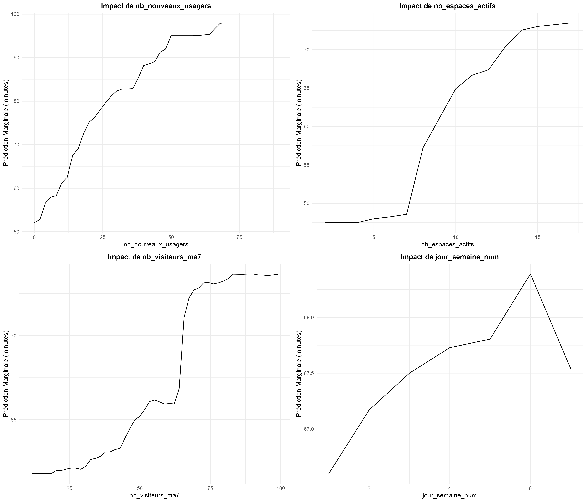
```


Afin d’interpréter les relations non linéaires apprises par le modèle de Random Forest, des Partial Dependence Plots (PDP) ont été utilisés. Ces graphiques représentent l’effet marginal moyen d’une variable explicative sur la fréquentation prédite, toutes choses égales par ailleurs.

Ces performances indiquent une capacité explicative élevée dans un contexte réel fortement bruité. Elles confirment que la fréquentation du Sèmè City Open Park est largement gouvernée par des dynamiques internes mesurables, tout en laissant subsister une part résiduelle liée à des facteurs non observés.


\newpage

# Discussion : Hypothèses et Résultats

Les trois hypothèses convergent vers un diagnostic commun : le principal levier d’amélioration de la fréquentation réside dans l’activation intelligente des usagers existants, bien plus que dans l’acquisition de nouveaux publics.

## Hypothèse H1 : Dynamiques internes et fréquentation

Les résultats de la modélisation confirment largement l’hypothèse H1. Le modèle Random Forest montre que les variables les plus explicatives de la fréquentation sont le nombre de nouveaux usagers (≈ 35 %), le nombre d’espaces actifs (≈ 20 %) et l’inertie de fréquentation à court terme (≈ 12 %). Ensemble, elles concentrent près de 66 % du pouvoir explicatif du modèle.

Les facteurs démographiques et temporels, bien que significatifs isolément, jouent un rôle secondaire une fois ces dynamiques internes prises en compte. La fréquentation apparaît donc comme un phénomène largement endogène, auto-renforcé par les usages du lieu lui-même.

Hypothèse H1 validée.

## Hypothèse H2 : Rôle critique de la première visite

Les analyses comportementales confirment le caractère déterminant de la première visite. Plus de 55 % des usagers ne reviennent jamais, et près d’un quart des visites ont lieu le jour même de l’inscription. La majorité des trajectoires d’usage s’interrompent donc très tôt.

Les cohortes présentant les meilleurs taux de rétention correspondent à des périodes où l’expérience initiale était plus structurée, suggérant un effet direct de l’onboarding sur la fidélisation.

Hypothèse H2 fortement validée.

## Hypothèse H3 : Potentiel latent et sous-exploitation des usages

La concentration extrême de la fréquentation confirme l’existence d’un potentiel non exploité. Moins de 8 % des usagers génèrent plus de la moitié des visites, tandis que 11 espaces ne représentent que 0,6 % de la fréquentation totale. De même, 70 % des usagers restent cantonnés à un seul espace.

Ces déséquilibres traduisent non pas un manque d’intérêt, mais une faible découvrabilité et une activation incomplète de l’offre existante.

Hypothèse H3 validée.

\newpage

# Préconisations Stratégiques

Les leviers identifiés sont majoritairement internes, maîtrisables et peu coûteux. Les simulations montrent qu’en combinant ces actions, le parc pourrait théoriquement générer jusqu’à 246 000 visites supplémentaires, soit +1 710 % par rapport à la situation actuelle.

Ce chiffre doit être interprété comme une borne haute, illustrant le potentiel latent du lieu, et non comme une projection mécanique

## Axe prioritaire 1 – Sécuriser la première visite

(Hypothèse H2 : la première visite est un moment décisif de la trajectoire d’engagement)

La cartographie de la fréquentation a mis en évidence une fragilité structurelle de la rétention initiale : plus d’un usager sur deux ne revient pas après sa première visite. Ce constat fait de l’onboarding le levier le plus critique et le plus rentable à court terme.

L’enjeu n’est pas d’ajouter de nouvelles offres, mais de donner du sens et une continuité immédiate à la première expérience vécue dans le parc.

Actions à activer dès aujourd’hui :

- formaliser un parcours d’accueil lisible pour les primo-visiteurs ;
- mettre en place un message de suivi systématique à J+2 ;
- inciter explicitement à une seconde visite (invitation, pass découverte, avantage symbolique).

Impact envisagé :

- conversion de 1 978 usagers occasionnels ;
- gain potentiel estimé : +10 944 visites ;
- coût opérationnel faible pour un impact très élevé.


## Axe prioritaire 2 – Rééquilibrer l’usage des espaces

(Hypothèses H1 et H3 : dynamiques internes et potentiel latent)

L’analyse spatiale révèle une concentration extrême de la fréquentation sur quelques espaces, tandis qu’une part significative du parc reste sous-exploitée. Cette configuration limite mécaniquement la capacité d’accueil globale et freine la diversification des usages.

L’objectif est donc de mieux distribuer les flux existants, sans chercher à augmenter artificiellement la fréquentation.

Leviers à mobiliser :

- création de parcours découverte reliant plusieurs espaces ;
- mise en place d’un pass ou badge multi-espaces ;
- renforcement de la visibilité des espaces sous-utilisés.

Impact envisagé :

- activation de 2 489 usagers mono-espace ;
- gain potentiel estimé : +22 392 visites ;
- amélioration de la durée moyenne de présence et de l’appropriation du lieu.


## Axe prioritaire 3 – Lisser la fréquentation dans le temps

(Hypothèse H1 : effets de rythme et inertie temporelle)

Les écarts observés entre jours et horaires traduisent une utilisation très inégale du parc dans le temps. Certains créneaux restent largement disponibles, sans que cela ne reflète un manque d’intérêt de la part des usagers.

L’enjeu est d’activer ces temps faibles de manière progressive, sans dégrader l’expérience sur les périodes de pointe.

Actions envisageables :

- programmation d’événements légers sur les créneaux creux (après 18h) ;
- communication ciblée et anticipée auprès des segments pertinents ;
- expérimentation de formats pilotes avant déploiement à grande échelle.

Impact envisagé :

- gain théorique maximal : +210 139 visites sur les jours faibles (borne haute) ;
- gain plus réaliste sur les créneaux horaires : +2 881 visites ;
- optimisation de l’utilisation de la capacité existante.


## Axe prioritaire 4 – Consolider le noyau d’usagers engagés

(Hypothèse H3 : dépendance à un noyau fidèle)

Une minorité d’usagers concentre aujourd’hui plus de la moitié de la fréquentation. Ce noyau constitue la colonne vertébrale du modèle de fréquentation et doit être sécurisé dans la durée.

L’objectif n’est pas seulement de les retenir, mais de reconnaître leur rôle structurant dans la vie du parc.

Pistes d’action :

- invitations personnalisées à des temps forts du parc ;
- reconnaissance symbolique (statut, accès privilégié, visibilité) ;
- intégration progressive dans la communauté et les dynamiques de co-création.

Impact envisagé :

- fidélisation de 789 explorateurs à fort potentiel ;
- gain estimé : +8 000 à +10 000 visites ;
- stabilisation des flux et réduction du risque de décrochage.


Cette feuille de route repose sur un principe simple : mieux activer l’existant avant de chercher la croissance externe. Les leviers identifiés sont majoritairement internes, contrôlables et peu coûteux. Leur déploiement progressif permettrait d’augmenter significativement la fréquentation tout en préservant l’identité et l’expérience du Sèmè City Open Park.

\newpage

# Limites de l'étude

Comme toute analyse fondée sur des données empiriques, cette étude présente un certain nombre de limites qu’il convient d’expliciter. Les identifier ne remet pas en cause la validité des résultats obtenus ; au contraire, cela permet d’en préciser la portée et d’ouvrir des perspectives d’amélioration pour les travaux futurs. Elles soulignent surtout que la donnée est un chantier vivant, dont l’amélioration progressive conditionnera la capacité du parc à mieux se comprendre, à mieux se piloter et à mieux se projeter.

## Une vision partielle de la réalité observée

La première limite majeure de cette étude réside dans la couverture incomplète des données disponibles. Les données issues de Smart SCOP ne reflètent qu’une fraction de la réalité des usages du Sèmè City Open Park. De nombreux publics fréquentant régulièrement le site ne sont que partiellement, voire pas du tout, référencés dans le système.

À titre d’exemple, seuls une cinquantaine d’étudiants de Africa Design School apparaissent dans la base, alors que plus de 300 étudiants sont inscrits pour l’année académique 2025, toutes filières confondues. De même, les enfants participant aux programmes du TinIMA ne sont pas intégrés au dispositif de suivi, alors même qu’ils occupent une place centrale dans la vie du parc.

Les données analysées constituent ainsi une goutte d’eau dans l’univers potentiellement observable des usages du lieu. Cette situation n’est pas sans rappeler la distinction entre univers observable et univers réel évoquée dans le documentaire L’homme n’est pas unique (Arte), où la connaissance scientifique progresse non pas en prétendant saisir le tout, mais en travaillant rigoureusement sur des fragments accessibles du réel.

## Une analyse centrée sur les flux, au détriment des activités

Cette étude s’est volontairement concentrée sur l’analyse des présences et des comportements d’usagers, indépendamment des activités programmées. Si ce choix a permis de dégager des régularités robustes sur la fréquentation globale, il constitue néanmoins une seconde limite.

Une analyse intégrant les données d’activités aurait permis de mieux comprendre :

- l’impact des formats proposés sur la fréquentation ;
- les effets de la programmation sur la fidélisation ;
- les interactions entre activités, espaces et trajectoires d’engagement.

L’exclusion de cette dimension prive l’analyse d’une lecture plus fine de la dynamique globale du lieu. Elle constitue cependant un axe de travail prioritaire pour des recherches futures, une fois la reconstitution et la fiabilisation des données d’activités achevées.

## Des effets exogènes difficilement observables

Certains facteurs susceptibles d’influencer la fréquentation n’ont pas pu être intégrés à l’analyse faute de données disponibles. Il s’agit notamment :

- des contraintes individuelles des usagers (emploi du temps académique, obligations professionnelles) ;
- des événements externes (examens, vacances, contexte socio-économique) ;
- des effets de communication hors ligne ou informels.

Ces éléments, bien que potentiellement influents, restent difficiles à mesurer et à isoler quantitativement. Leur absence peut expliquer une part résiduelle de la variance non expliquée par les modèles.

## Vers un outil unifié de gestion des données

L’ensemble de ces limites converge vers une cinquième recommandation structurante :
la nécessité de mettre en place un outil unifié de gestion des données au Sèmè City Open Park.

Aujourd’hui, les informations relatives aux usagers, aux activités et aux usages sont dispersées entre plusieurs outils hétérogènes, rendant difficile la reconstitution complète de l’expérience vécue par un individu au sein du parc.

Un système unifié permettrait :

- de créé une mémoire collective de l'historique du parc ;
- de retracer le parcours complet d’un usager (inscription, visites, activités, fidélisation) ;
- d’améliorer la qualité et la continuité des données collectées ;
- de renforcer la capacité d’analyse et de pilotage stratégique à long terme.

La mise en place d’un tel dispositif constitue une condition essentielle pour approfondir les analyses futures et accompagner durablement la montée en maturité du Sèmè City Open Park.


\newpage

# Conclusion

« Venez avec une idée, repartez avec un prototype. »
Cette promesse résume l’essence du Sèmè City Open Park. Elle a également guidé cette étude, pensée comme un prototype analytique : partir de données imparfaites pour faire émerger des leviers concrets d’action.

L’analyse montre que la fréquentation du SCOP n’est ni aléatoire ni uniquement déterminée par les infrastructures. Elle repose sur des dynamiques internes structurantes : un noyau restreint d’usagers fortement engagés, des rythmes temporels marqués, une attractivité spatiale inégale et un moment clé situé dès la première visite. La fréquentation relève ainsi moins de volumes bruts que de trajectoires d’usage.

En mobilisant des analyses descriptives, des outils statistiques et des approches prédictives, ce travail a permis d’identifier des facteurs d’influence hiérarchisés et de formuler des préconisations stratégiques directement actionnables. L’enjeu n’est pas d’attirer toujours plus, mais de mieux accueillir, mieux orienter et mieux fidéliser.

Cette étude constitue une première brique vers un pilotage du SCOP fondé sur la donnée. Comme tout prototype, elle appelle à être testée, enrichie et améliorée. Le Sèmè City Open Park est un lieu où l’on fabrique des objets, mais surtout des possibles. Ce travail s’inscrit dans cette dynamique : un outil au service d’un projet profondément humain, destiné, espérons-le, à devenir durablement utile à cette promesse.

# Sources

## Les données

SMART SCOP. (2025). Base de données de fréquentation et d’usages du Sèmè City Open Park.


## Référence culturelle et épistémologique

ARTE. (2019). L’homme n’est pas unique [Documentaire].
→ Référence mobilisée pour illustrer la distinction entre univers observable et réalité totale, en lien avec les limites de l’étude.


\newpage
\includepdf{medias/the_end.pdf}

